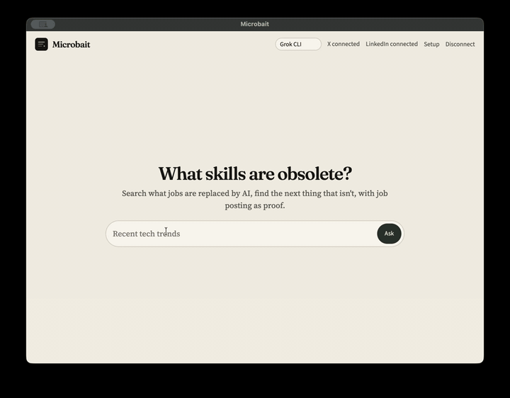

# Microbait



Microbait helps jobseekers survive AI by identifying what skills are made obsolete becasue of AI, and what skills become more demanded as a result.

It works by reading what users on X brag about in thier latest tech demos and paper publication, and use AI to summarize:
- what skils are being automated
- what is the next bottleneck as a result
- what job posts are already there as a result of the change in demand.

Now it runs on either Grok Build or OpenCode free API. I epxect users will be able to switch the underlying AI as they see fit.
This app is published under MIT license.

## Run

```bash
cd ~/code/microbait
npm install
npm start
```

On first launch, open **Setup**:

1. **Connect X** — Chrome opens to the X login. Sign in there.
2. **Connect LinkedIn** — sign in in the right-hand panel.
3. Pick **Grok CLI** or **OpenCode API**. For OpenCode, paste a key from [opencode.ai/auth](https://opencode.ai/auth).

Then ask something like “Recent tech trends”.

Optional overrides in a local `.env` (copy `.env.example`):

- `GROK_BIN`, `GROK_MODEL`, `GROK_REASONING` for the Grok CLI
- `OPENCODE_API_KEY`, `OPENCODE_URL`, `OPENCODE_MODEL` for OpenCode (default model is `big-pickle`)

## Eval

```bash
./eval.sh
```

That runs the unit tests and a frozen bait-corpus metric. Higher is better.

## End-to-end

`npm start` also opens a debug port on `127.0.0.1:9222`. With the app already signed in:

```bash
npm run test:e2e
```

That attaches to the Microbait window, clicks Ask, and prints the briefing.
